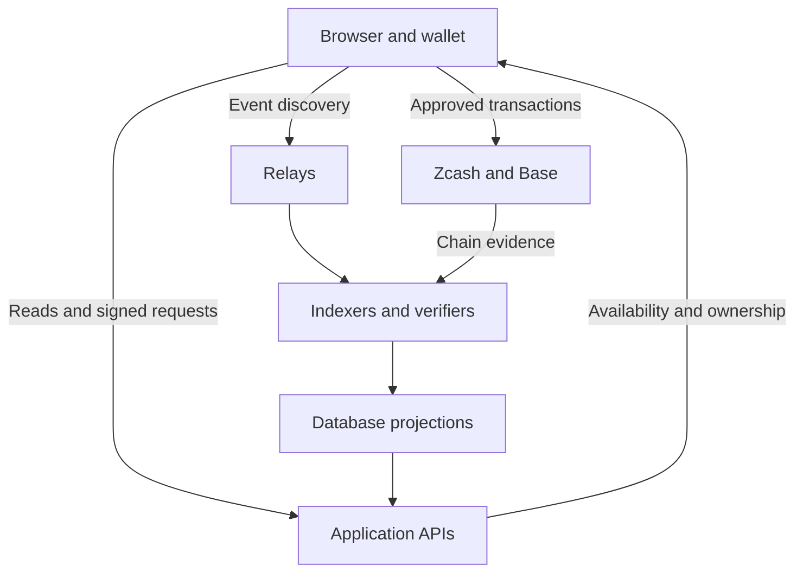

# Architecture and trust boundaries

ZEC BLOCKS currently combines public-chain transactions with hosted application services. A reader should be able to distinguish an immutable transaction from a server's interpretation of that transaction.

## Components

| Component | Responsibility | Dependency or limit |
| --- | --- | --- |
| Mining browser | Proof search, wallet prompts, previews, recovery records | Local storage and wallet integration; browser work alone does not establish ownership |
| Marketplace browser | Listings, checkout, recipient proof checks, recovery | Uses backend snapshots and chain/provider reads |
| Noir Wallet | Holds Zcash keys, signs messages, approves and broadcasts transactions | Derived identity stability and supported signing interfaces matter |
| Base wallet and contracts | Approve and settle USDC transactions | Does not independently validate every Zcash NFT rule |
| Vercel API proxies | Route application requests to backend and chain providers | Hosted availability dependency; proxy access is not proof of wallet ownership |
| Supabase database and workers | Availability, reservations, event verification, balances and ownership projections | Operator-controlled code/configuration; full production reconstruction is not bundled |
| Nostr relays | Transport and discover protocol records | An event found on a relay is not automatically valid; missing history can limit reconstruction |
| Zcash / Base | Consensus and transaction history for the relevant chain | Consensus does not enforce all ZB-1/ZB-20 application rules |

## Where data lives

Zcash transactions contain outputs and, where used, shielded memo data. A shielded memo is not readable by every public explorer. The current ZECS mint flow keeps its registration signature and holder evidence separately from the mint memo. Indexers and databases hold discovered events, evidence and computed state. Browsers keep pending-operation metadata and preferences.

NFT artwork can be regenerated by the deterministic renderer from the specified collection inputs. Serving an image from a website does not itself prove or disprove valid ownership. Conversely, a deterministic image does not establish that all ownership evidence is publicly available.

## What operators can and cannot change

An operator can change a hosted interface, API, database projection or verification policy. A database administrator can affect the state displayed by that deployment. Those powers remain relevant even when technical details are published.

An operator cannot rewrite an already confirmed chain transaction by editing a database, or produce another person's valid wallet signature without that signing capability. Independently rejecting a false state nevertheless requires the complete relevant evidence, correct rules and chain verification. A transaction ID by itself is insufficient.

The Base ZECS marketplace additionally uses an operator-held verifier signing key for market authorizations. It is not a user's wallet key, but it is a real trust dependency. The reviewed source does not establish fully trustless cross-chain settlement.

## Openness today

These pages expose the rules, architecture, selected code and known limits for review. They do not provide a complete, independently reproducible copy of every production service and historical event. See the [code examples](reference-implementation.md) and [roadmap](roadmap.md).
